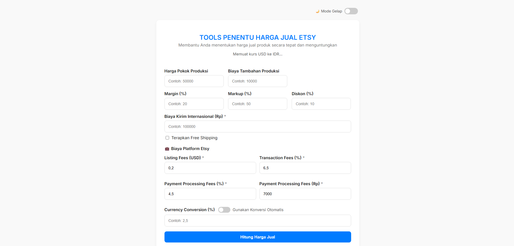
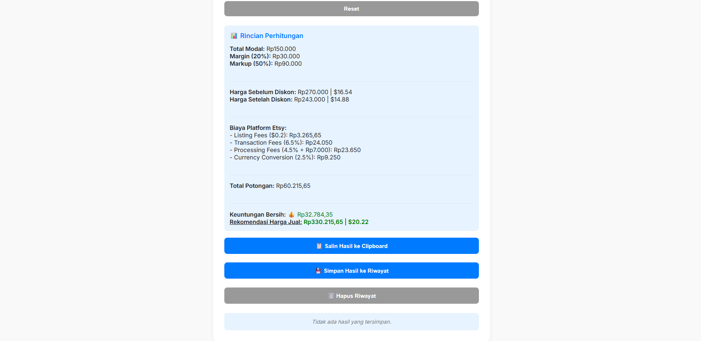

# 💸 Tools Penentu Harga Jual Etsy

Sebuah web tools berbasis Progressive Web App (PWA) untuk membantu Anda menghitung harga jual produk di Etsy secara akurat dengan mempertimbangkan:

- Harga pokok produksi
- Biaya tambahan
- Margin, markup, dan diskon
- Biaya pengiriman internasional
- Terapkan Free Shipping (Ongkir dimasukkan ke Harga Jual)
- Biaya platform Etsy (listing, transaksi, pemrosesan)
- Konversi mata uang USD ke IDR
- Kurs USD ke IDR real-time

## 🛠️ Fitur

- 💻 Desain responsif (PC & HP)
- 🌙 Mode Gelap / Terang
- 🏷️ Hitung harga berdasarkan margin & markup
- 💰 Perhitungan otomatis potongan Etsy
- 🔄 Riwayat hasil tersimpan di Local Storage
- 📋 Fitur salin hasil
- 📲 Bisa ditambahkan ke layar utama (Add to Home Screen)

## 📸 Screenshots

| Tampilan Awal | Mode Gelap | Hasil Perhitungan |
|---------------|------------|-------------------|
|  |  |  |

## 🚀 Cara Menjalankan

1. Kunjungi: [https://pahmiabdaziz.github.io/harga-jual-etsy](https://pahmiabdaziz.github.io/harga-jual-etsy)
2. Klik tombol menu browser → "Add to Home Screen"
3. Nikmati tools ini seperti aplikasi HP!

## 🧠 Teknologi

- HTML, CSS, JavaScript
- Fetch API untuk kurs USD-IDR
- PWA: manifest + service worker

## 📦 Cara Clone dan Jalankan Lokal

```bash
git clone https://github.com/pahmiabdaziz/harga-jual-etsy.git
cd harga-jual-etsy
# Buka index.html di browser


## ⚠️ Catatan
----------

Untuk data kurs real-time, tools ini menggunakan API dari:  
`https://open.er-api.com/v6/latest/USD`  
Jika API tidak bisa diakses, akan fallback ke kurs default Rp16.000.

